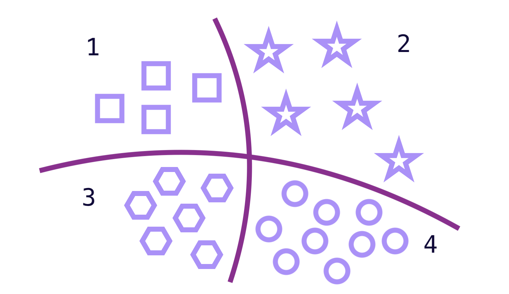

# Multi-class-classification Projects

Welcome to my collection of **Multi-class-classification** projects. This repository showcases a variety of real-world applications where Multi-class-classification techniques are applied to analyze and classify data.

  

---

## 📁 Projects Included

| Project Name              | Description                                      |
|---------------------------|--------------------------------------------------|
| **Metals Classification**     | I perform Fluorescence-Based Metal Classification via Wavelength Excitation using RGB coordinates as features. |
| **Alcoholic drinks Classification** | I perform the alcoholic drinks classification. |

---

## 🔧 Technologies Used

- Python  
- Scikit-learn  
- TensorFlow / Keras  
- Pandas / NumPy  
- NLTK / spaCy  
- Matplotlib / Seaborn  
- Jupyter Notebook

